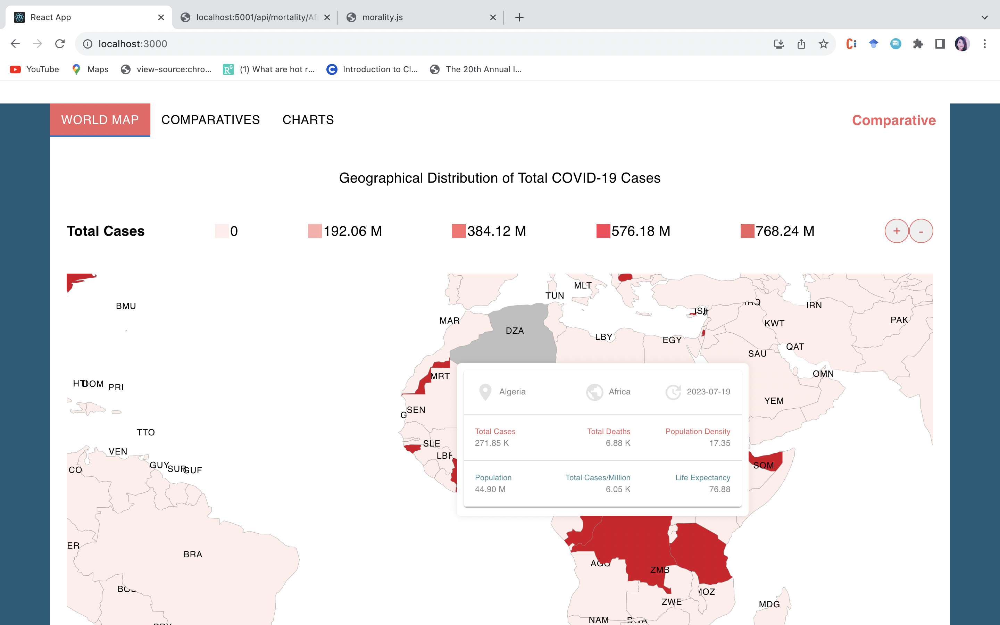
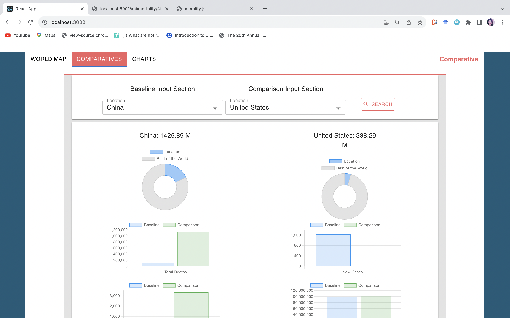
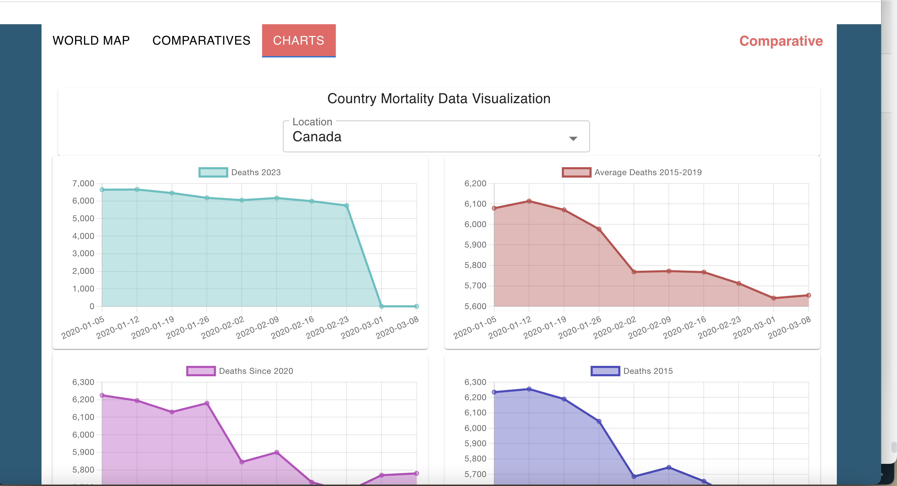

# COVID Data Visualization App

## Table of Contents
- [Introduction](#introduction)
- [Features](#features)
- [Installation](#installation)
- [Usage](#usage)
- [Worldmap Page](#worldmap-page)
- [Comparatives Page](#comparatives-page)
- [Charts Page](#charts-page)
- [Screenshots](#screenshots)
- [Contributing](#contributing)
- [License](#license)

## Introduction

The COVID Data Visualization App is a web application that allows users to visualize and explore COVID-19 and mortality data across different countries. The app provides interactive and insightful charts, graphs, and a world map to help users understand and analyze the impact of COVID-19 on a global scale.

## Features

- Interactive world map with COVID-19 statistics by country
- Comparative data analysis for multiple countries
- Visual representation of mortality data through charts
- Real-time data updates

# COVID Data Visualization App

This is a comprehensive COVID data visualization app built with React and Redux. It provides users with three main pages:

## Worldmap Page

The Worldmap page displays a world map with color-coded markers representing COVID statistics for different countries. Users can interact with the map to view detailed information about each country.

## Comparatives Page

The Comparatives page allows users to compare COVID statistics between multiple countries using interactive charts and graphs. Users can customize the data they want to compare and visualize the trends over time.

## Charts Page

The Charts page presents various charts and graphs showcasing COVID-related data for a specific country. Users can select a country from the dropdown menu to view the data visualization.

## Installation

To run the app locally, follow these steps:

1. Clone the repository to your local machine.
2. Navigate to the project directory.
3. Install the required dependencies using `npm install`.
4. Start the development server using `npm start`.

## Usage

Once the app is running, you can access it by visiting `http://localhost:3000` in your web browser.

## Worldmap Page

The Worldmap page displays an interactive world map with markers for each country. Each marker represents the country's COVID-19 statistics, such as the number of confirmed cases, deaths, and recoveries. Users can click on a marker to view detailed information about that specific country. The map also supports zooming and panning for better navigation.

## Comparatives Page

The Comparatives page allows users to select multiple countries and compare their COVID-19 data side by side. Users can choose specific statistics to compare, such as confirmed cases, deaths, recoveries, and more. The data is displayed in tabular format for easy comparison.

## Charts Page

The Charts page offers various charts and graphs to visualize COVID-19 mortality data. Users can select a country and view the corresponding mortality data represented in line charts. The charts display information about deaths in different years, including 2023, average deaths from 2015 to 2019, deaths since 2020, and deaths in 2015.

## Contributing

Contributions to the COVID Data Visualization App are welcome! If you find any issues or want to add new features, please create a pull request with your changes. Before contributing, make sure to read the [contribution guidelines](CONTRIBUTING.md).

## License

This project is licensed under the [MIT License](LICENSE). Feel free to use, modify, and distribute the code as per the terms of the license.
